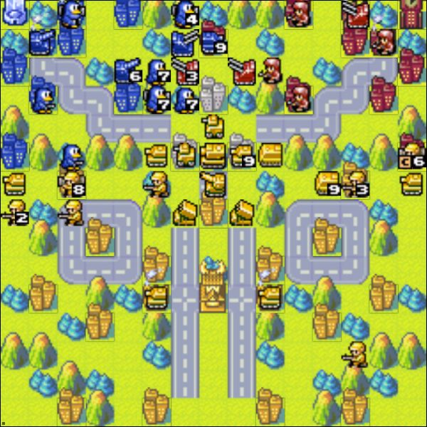

# AWBW Replay Recorder

These scripts were created to save replays from the awesome website [Advance Wars by Web](https://awbw.amarriner.com/) to gif or movie files. The code works by taking snapshots of the replays at each turn (through [Selenium](https://selenium-python.readthedocs.io/)) and compiling the snapshots into gif files through [ImageMagick](https://imagemagick.org/index.php).

## Instructions

First time setup and use are still a bit clunky but I'm making improvements in usability as time allows.

### Installation and Setup

1. Download the contents of the repository to your computer.
2. Download the [Selenium driver for Chrome](https://chromedriver.chromium.org/downloads).
3. Place the file in a folder (ideally `./chromedriver/chromedriver` relative to the scripts folder).
4. Install ImageMagick for `gif` export.
5. Install the [conda environment](https://github.com/Chipdelmal/AWBWReplayRecorder/tree/main/conda) or the required python packages independently (see **Dependencies**).

### Use

0. Upload the replay file if needed (in case it has already been deleted from the server).
1. Get the match ID and number of turns as detailed in my [blog post](https://chipdelmal.github.io/blog/posts/awbw).
2. Launch the [bash script](./awbw.sh) from the terminal as: 
    `./awbw.sh ID DESIRED_MATCH_NAME TURNS_NUMBER ZOOM_LEVEL EXPORT_PATH`
    (for more info on these variables, look at the [awbw.sh](./awbw.sh) file or my [blog post](https://chipdelmal.github.io/blog/posts/awbw).
3. Wait until the whole script has finished (might take a while).
4. Two GIFs and an MP4 file should show up in the provided path.

### Debugging note

If something's not working correctly, try modifying the `HEADLESS` variable in the [constants](./constants.py) file. This will make the chromedriver visible if it's launching correctly.

## More information

I've documented the code a bit over on my [blog post](https://chipdelmal.github.io/blog/posts/awbw). It's not comprehensive, but it might be handy if something is nor working correctly. The explanations on why the script takes so long and avenues for possible modifications are also detailed in it.

## Dependencies

* [Selenium](https://selenium-python.readthedocs.io/)
* [Pillow](https://pillow.readthedocs.io/en/stable/)
* [ImageMagick](https://imagemagick.org/index.php)

# Author

 

[Héctor M. Sánchez C.](https://chipdelmal.github.io/blog/)
